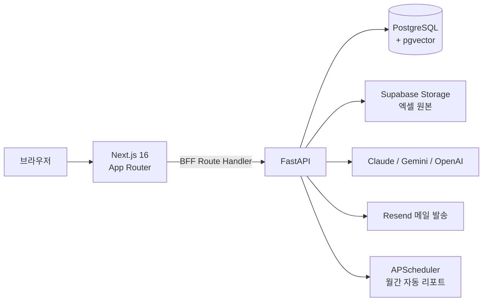

# 마케팅 AI 분석기

**광고 데이터를 정리하는 시간을, 성과를 올리는 시간으로.**

매체·전환 데이터를 올리면 리포트 집계부터 AI 분석 코멘트 작성, 고객사 메일 발송까지 한 번에 이어지는 마케팅 실무 자동화 플랫폼입니다. 소재 이미지 정제와 헤딩 문구 추천까지 같은 계정, 같은 화면에서 처리합니다.

---

## 이런 팀을 위해 만들었습니다

광고 대행사와 인하우스 마케팅팀의 월간 리포트는 대부분 이렇게 만들어집니다.

> 매체별로 CSV를 내려받아 → 엑셀에 붙여넣고 → 서식을 맞추고 → 전월 수치와 비교해 → 코멘트를 직접 쓰고 → 메일로 보낸다.

데이터가 늘어나도, 매체가 늘어나도, 이 과정은 줄지 않습니다. 리포트 한 건에 반나절이 사라지고, 정작 **성과를 해석하고 다음 액션을 정하는 일**은 뒤로 밀립니다.

이 서비스는 그 반나절을 없애는 것을 목표로 만들었습니다.

| | 기존 방식 | 마케팅 AI 분석기 |
|---|---|---|
| 데이터 취합 | 매체별 파일을 열어 수작업 병합 | CSV·Excel 드래그 앤 드롭 → 자동 집계 |
| 기간 관리 | 파일명과 폴더로 관리 | 연·월 단위 DB 저장, 언제든 재조회 |
| 성과 코멘트 | 담당자가 직접 작성 | AI가 초안 작성 → 사람이 검토·수정 |
| 전월 비교 | 눈으로 대조 | 키워드 단위 자동 비교 |
| 리포트 전달 | 파일 첨부해 수동 발송 | 화면에서 바로 발송 + 발송 로그 기록 |
| 정기 리포트 | 매달 잊지 않고 챙기기 | **매월 1일 자동 발송** |

---

## 핵심 기능

### 📊 SA 광고 대시보드
매체·전환 CSV를 올리면 연·월 단위로 집계해 한 화면에 보여줍니다. 저장된 기간은 언제든 다시 조회하고 Excel로 내려받을 수 있으며, 잘못 올린 데이터는 **되돌리기 한 번으로 업로드 직전 상태로 복원**됩니다.

### ✍️ AI 분석 코멘트 & 리포트 메일
AI가 기간별 성과 변화를 읽고 리포트 코멘트 초안을 작성합니다. 담당자가 검토·수정한 뒤 그대로 메일로 발송하고, 누구에게 언제 나갔는지 발송 로그에 남습니다. 실패한 건은 관리자 화면에서 재발송할 수 있습니다.

### 🔁 키워드 성과 비교
이번 기간과 이전 기간의 키워드 전환 성과를 자동으로 맞대어 보여줍니다. 어떤 키워드가 올랐고 무엇이 빠졌는지 찾아다닐 필요가 없습니다.

### 🎨 이미지 정제 · 리사이저
소재 이미지를 올리고 원하는 수정을 문장으로 적으면 AI가 그대로 편집합니다. 매체별 규격에 맞춘 JPEG · PNG · WebP 변환도 한 번에 처리해, 간단한 보정 때문에 디자인 요청을 기다릴 필요가 없습니다.

### 💡 헤딩 문구 추천
AI가 소재 이미지를 분석해 매체별 헤딩 문구를 제안합니다. 생성한 문구는 기록에 쌓여 검색·복사해 다시 쓸 수 있습니다.

### 🗓️ 월간 자동 리포트
매월 1일 지정한 수신자에게 전월 리포트가 자동으로 발송됩니다. 발송 시각과 대상은 환경변수로 조정할 수 있습니다.

---

## 기술 스택

### 프론트엔드

| 영역 | 기술 |
|---|---|
| 프레임워크 | **Next.js 16** (App Router · Turbopack), **React 19** |
| 언어 | TypeScript |
| 스타일 | Tailwind CSS v4, 다크모드 대응 디자인 토큰 (WCAG AA 대비 기준) |
| 서버 상태 | TanStack Query v5 |
| 클라이언트 상태 | Zustand |
| 인증 | Auth.js (NextAuth v5) |
| 기타 | next-themes, Framer Motion, Boxicons |

### 백엔드

| 영역 | 기술 |
|---|---|
| 프레임워크 | **FastAPI** (Python 3.14) |
| ORM · 마이그레이션 | SQLAlchemy 2.0, Alembic |
| 데이터베이스 | **PostgreSQL** (Supabase) + **pgvector** |
| 인증 · 보안 | JWT (access / refresh), bcrypt, slowapi 레이트 리밋 |
| 데이터 처리 | pandas, openpyxl |
| 메일 | Resend (SMTP 폴백 지원) |
| 스케줄러 | APScheduler |
| 파일 저장 | Supabase Storage |
| 테스트 · 린트 | pytest (23개 테스트 모듈), ruff |

### AI

| 용도 | 모델 |
|---|---|
| 리포트 분석 코멘트 | **Claude · Gemini · OpenAI 교체 가능** (`LLM_PROVIDER` 설정) |
| 이미지 편집 · 헤딩 문구 추천 | Google Gemini |
| 과거 코멘트 검색 (RAG) | OpenAI 임베딩 + pgvector 벡터 검색 |

LLM 호출부는 `AbstractLLMClient` 인터페이스 뒤에 두어, **설정값 하나로 모델 제공사를 갈아끼울 수 있습니다.** 특정 벤더에 종속되지 않는 구조입니다.

### 인프라

| 영역 | 기술 |
|---|---|
| 배포 | Google Cloud Run (asia-northeast3) |
| 빌드 | Cloud Build + Artifact Registry, Docker (uv 기반 멀티스테이지 캐시) |
| 시크릿 | Google Secret Manager |

---

## 아키텍처



**BFF(Backend for Frontend) 패턴** — 브라우저는 FastAPI를 직접 호출하지 않습니다. Next.js Route Handler가 세션에서 토큰을 꺼내 대신 호출하므로, **액세스 토큰이 브라우저 자바스크립트에 노출되지 않습니다.**

---

## 운영을 염두에 둔 설계

기능이 도는 것과 회사에서 쓸 수 있는 것은 다릅니다. 실제 운영에서 문제가 되는 지점들을 미리 처리해 두었습니다.

- **DB 마이그레이션 선행 배포** — 배포 파이프라인에서 마이그레이션을 앱 기동보다 먼저, 별도 단계로 실행합니다. 실패하면 새 리비전이 아예 나가지 않아 스키마 불일치로 인한 장애를 원천 차단합니다.
- **기능 플래그** — 관리자가 화면에서 기능별로 켜고 끕니다. 문제가 생긴 기능만 점검 안내로 바꿔 두고 나머지는 정상 운영할 수 있습니다.
- **AI 예산 상한** — 월간 토큰 예산을 설정하면 초과 시 호출 자체를 차단합니다. AI 비용이 예상 밖으로 새어 나가지 않습니다.
- **AI 사용 이력 추적** — 어떤 도구를 누가 언제 얼마나 썼는지 토큰 단위로 기록됩니다.
- **로그인 보호** — 연속 실패 시 계정 잠금(기본 15분), 엔드포인트 레이트 리밋, 역할 기반 접근 제어(일반 / 관리자).
- **업로드 되돌리기** — 업로드 직전 상태를 스냅샷으로 남겨 잘못된 데이터를 즉시 되돌립니다.
- **백그라운드 작업 추적** — 대용량 엑셀 처리는 백그라운드로 돌리고 진행률을 실시간 표시합니다. 브라우저를 새로고침해도 진행 상황이 유지됩니다.
- **감사 로그** — 리포트 발송 결과, 업로드 이력, AI 사용 내역이 모두 조회 가능한 형태로 남습니다.

---

## 개발

**한다솔 (DaSolHan) · 1인 기획 · 개발 · 배포**

기획, 데이터 파이프라인 설계, 백엔드 API, 프론트엔드 UI/UX, AI 연동, 인프라 구성과 배포까지 전 영역을 단독으로 담당했습니다.

- 개발 기간: 2026년 5월 ~ (진행 중)
- 커밋 79개 · Alembic 마이그레이션 7단계 · pytest 테스트 모듈 23개

---

## 프로젝트 구조

```
SYProject
├── front/        Next.js 16 프론트엔드 (App Router)
│   ├── app/      페이지 · BFF Route Handler
│   ├── components/
│   └── lib/
├── back/         FastAPI 백엔드
│   ├── app/
│   │   ├── routers/       API 엔드포인트
│   │   ├── services/      비즈니스 로직 · LLM · 메일
│   │   ├── repositories/  데이터 접근
│   │   ├── models/        SQLAlchemy 모델
│   │   └── core/          설정 · 보안 · 기능 플래그 · 예산
│   ├── migrations/        Alembic
│   └── tests/             pytest
└── docs/         설계 · 변경 이력 문서
```

## 로컬 실행

```bash
# 백엔드 (Python 3.14 · uv)
cd back
uv sync
uv run uvicorn app.main:app --reload

# 프론트엔드 (Node.js)
cd front
npm install
npm run dev
```

각 디렉터리의 `.env` 설정이 필요합니다. 백엔드 마이그레이션 운영 방법은 [back/MIGRATIONS.md](back/MIGRATIONS.md)를 참고하세요.
